# WEVI : 편리한 웨딩 일정 관리 플랫폼

 > 결혼 준비 과정 속에서 혼자, 때로는 함께 챙겨야 하는 복잡한 일정을 자동으로 생성/관리해주고, 손쉽게 공유할 수 있도록 도와주는 서비스 **WEVI(웨비)** 입니다.

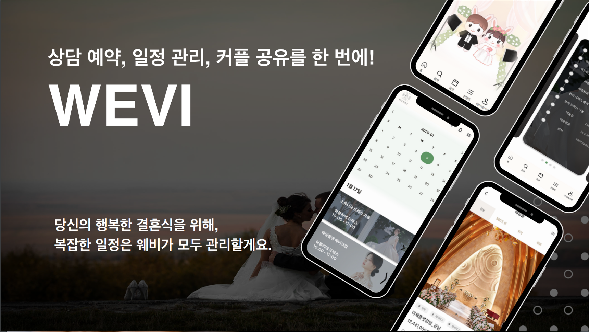

<br/>

# 📌 목차

### 1️⃣ [팀원 소개](#1-팀원-소개)
### 2️⃣ [서비스 소개](#2-서비스-소개)
### 3️⃣ [서비스 화면](#3-서비스-화면)
### 4️⃣ [개발 환경](#4-개발-환경)
### 5️⃣ [기술 특이점](#5-기술-특이점)
### 6️⃣ [기획 및 설계 산출물](#6-기획-및-설계-산출물)
### 7️⃣ [Conventions](#7-conventions)
### 8️⃣ [개발 회고](#8-개발-회고)

<br/>

# 1. 팀원 소개

&nbsp;

## 💞 팀원 소개

<table>
    <tr>
        <td height="140px" align="center"> <a href="https://github.com/seongilhwang97">
             <br><br> 👑 황성일 <br>(Team Leader, Front-End) </a> <br></td>
        <td height="140px" align="center"> <a href="https://github.com/userdkdk">
             <br><br> 👶🏻 고대권 <br>(Front-End Leader) </a> <br></td>
        <td height="140px" align="center"> <a href="https://github.com/yunsun99">
             <br><br> 👶🏻 정윤선 <br>(Back-End Leader, AI) </a> <br></td>
        <td height="140px" align="center"> <a href="https://github.com/SeonggeunPark">
             <br><br> 👶🏻 박성근 <br>(Back-End, AI) </a> <br></td>
        <td height="140px" align="center"> <a href="https://github.com/dwshin-dev">
             <br><br> 👶🏻 신동운 <br>(Back-End, Infra) </a> <br></td>
    </tr>
    <tr>
         <td>
            - 피그마 디자인
            <br/>
            - 공통 컴포넌트 생성
            <br/>
            - 업체 검색 및 상세 페이지
            <br/>
            - 업체 일정 관리 페이지
            <br/>
            - 유저 진행도 연동 페이지
            <br/>
            - 마이페이지
            <br/>
            - AI 상담 내용 분석 페이지
         </td>
         <td>
            - 피그마 디자인
            <br/>
            - 공통 컴포넌트 생성
            <br/>
            - 회원가입/ 로그인 페이지
            <br/>
            - 커플 연동 페이지
            <br/>
            - 푸시 알림 기능
            <br/>
            - AI 플래너 페이지
         </td>
         <td>
            - 프로젝트 초기세팅
            <br/>
            - Spring Security를 이용한 회원 관리 API
            <br/>
            - FCM 이용한 푸시 알림 전송
            <br/>
            - 커플 연동 API
            <br/>
            - 상담 예약 가능한 날짜 / 시간 조회 API
            <br/>
            - AI 웨딩 플래너 코드 작성
         </td>
         <td align="center"><br/>각자 구현한 기능 및 페이지</td>
         <td align="center"><br/>각자 구현한 기능 및 페이지</td>
    </tr>
</table>

&nbsp;

# 2. 서비스 소개

WEVI(웨비)는 결혼을 준비하는 예비 부부들을 위한 올인원 웨딩 일정 관리 플랫폼입니다.       
실제 예비 신혼부부들을 인터뷰하여 **복잡한 일정 관리, 상담 예약의 어려움, 부부 간 일정 공유 문제**를 해결하는 서비스를 제공합니다.

&nbsp;

## 📆 프로젝트 기간  
### 2025.01.06 ~ 2025.02.21

- **기획 및 설계**: 2025.01.06 ~ 2025.01.17  
- **프로젝트 구현**: 2025.01.18 ~ 2025.02.14  
- **버그 수정 및 산출물 정리**: 2025.02.15 ~ 2025.02.20  
- **코드 리팩토링**: 2025.02.21 ~  

&nbsp;

## 🚀 주요 기능

### ✅ 웨딩 일정 관리  
- **업체 검색 및 필터링**: 웨딩 업체를 쉽게 검색하고 필터링  
- **상담 예약 및 일정 자동 등록**: 번거로운 상담 예약을 간편하게 처리하고 상담 일정을 캘린더에 자동 등록  
- **중간 과정 조회**: 계약한 업체의 계약에 대한 업무 진행 상황을 쉽게 확인
- **커플 연동 기능**: 예비 부부 간 자동 캘린더 동기화를 통해 간편하게 일정 공유

### ✅ AI 기능  
- **AI 상담 요약**: GPT-4를 활용하여 상담 내용을 자동 요약  
- **AI 플래너**: 사용자의 요구 사항을 분석해 웨딩 업체 추천  

&nbsp;

## 🔧 기술 스택

### **프론트엔드**
- React 18.3.0, Vite 6.0.5
- JavaScript(ES6), Node.js 20
- Tailwind CSS 4.0.0
- Firebase Cloud Messaging

### **백엔드**
- Spring Boot 3.3.7, Oracle Open JDK 17 
- Spring Data JPA, Spring Security 6.4.2  
- MySQL 8.0.41
- FastAPI 
- Firebase Cloud Messaging

### **AI 기술**
- OpenAI GPT-4, Whisper, Pyannote  
- Hugging Face SBERT (웨딩 업체 추천)  

### **CI/CD 및 서버**
- AWS EC2, Docker, Jenkins, Nginx  
- Ubuntu 24.04.1 LTS, S3  

&nbsp;

## 🧠 AI 기술 활용

### 음성 분석을 위한 Whisper 및 Pyannote 모델 활용
 - Pyannote 모델을 사용하여 화자를 분리하고 대화 내용을 분석
 - OpenAI Whisper 모델을 활용하여 음성 데이터를 텍스트로 변환
 - 변환된 텍스트를 OpenAI GPT 모델을 통해 분석하여 핵심 내용을 자동으로 요약

### AI 기반 웨딩 업체 추천 시스템
 - Hugging Face의 Transformers 모델을 활용하여 자연어 처리(NLP) 기반 추천 시스템 구현
 - 기존 웨딩 업체 데이터를 벡터화하여 사용자의 요구 사항과 가장 유사한 업체를 매칭
 
&nbsp;

## 📌 기대 효과  

✅ **예비 부부**: 일정 자동화 및 공유 기능을 통해 웨딩 준비 과정 간소화  
✅ **웨딩 업체**: 효율적인 상담 및 일정 관리, 중소 업체의 소비자 노출 기회 확대  

**WEVI는 예비 신혼부부의 웨딩 준비를 더욱 편리하고 체계적으로 만들어주는 서비스입니다!**  

&nbsp;

# 3. 서비스 화면  

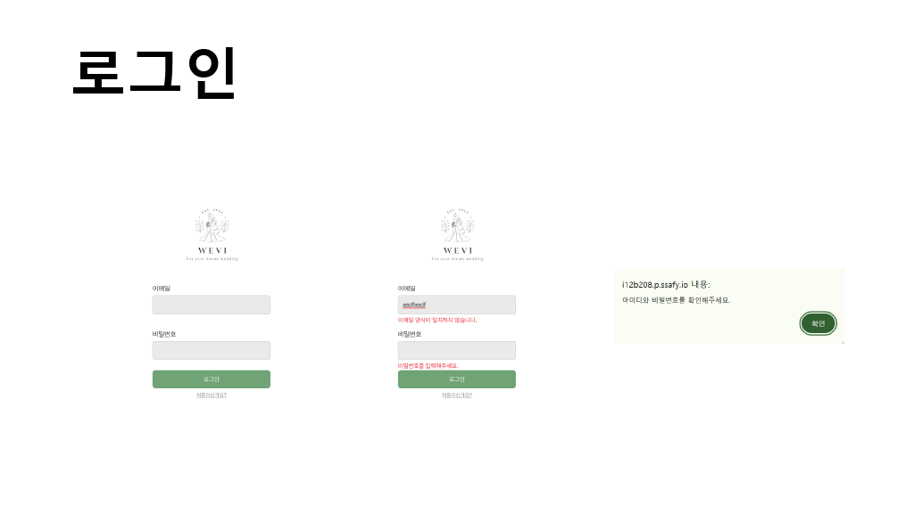
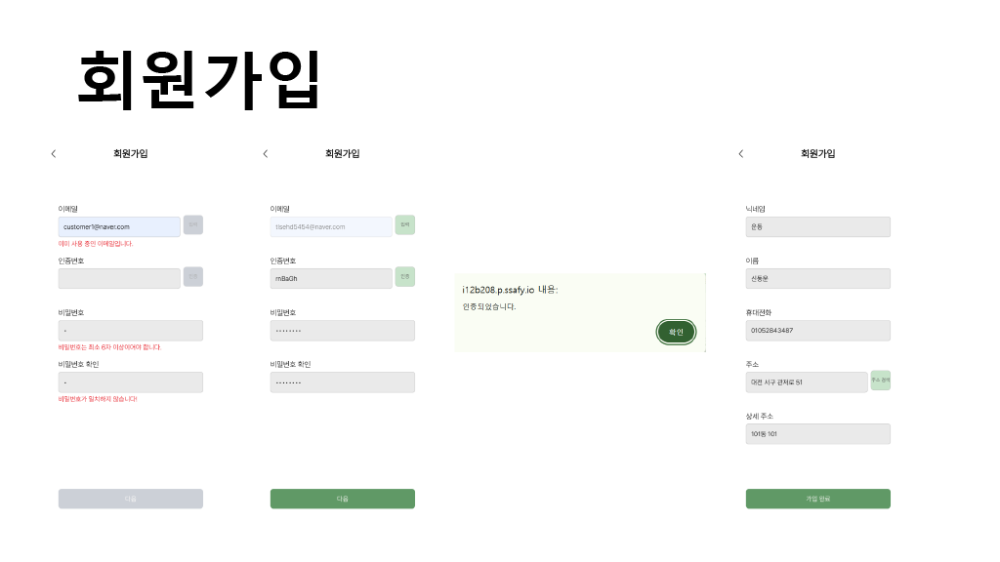
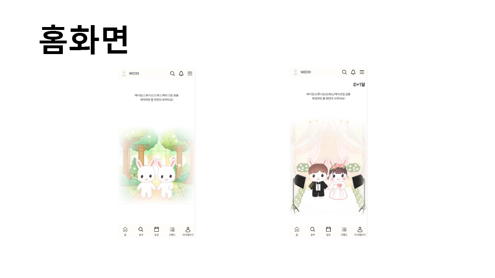
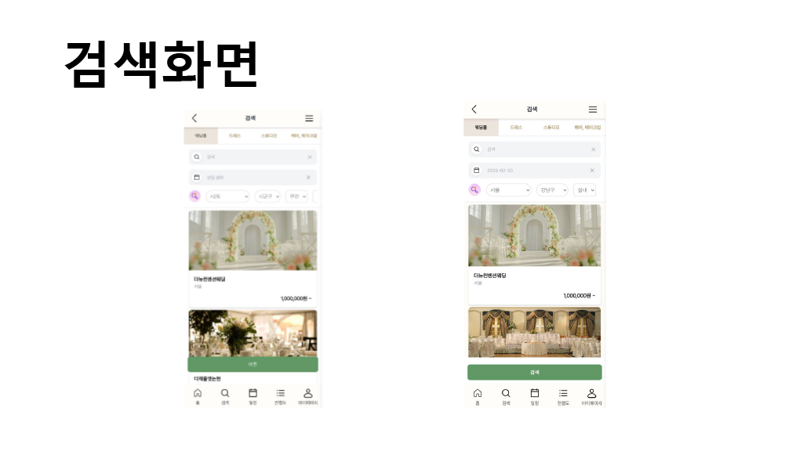
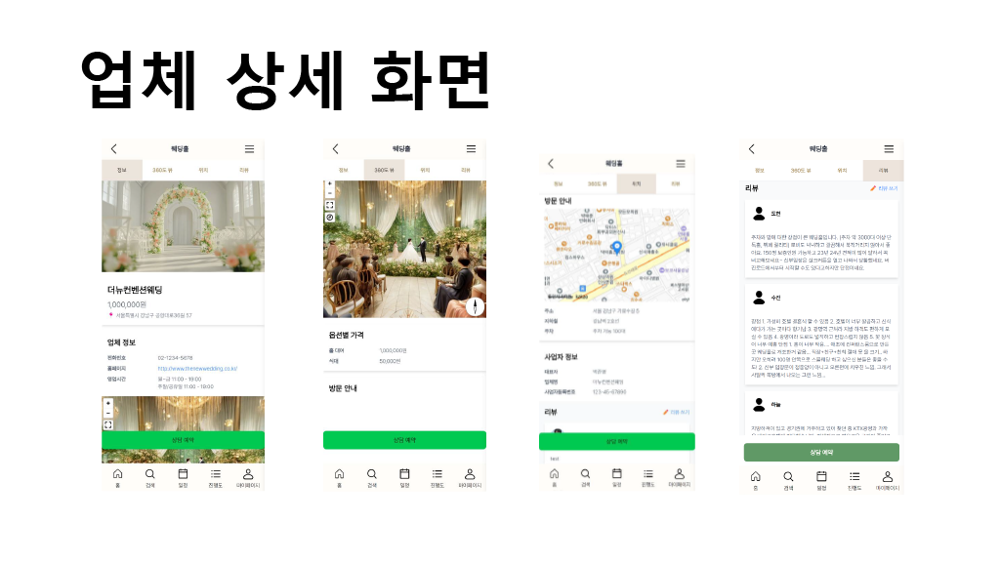
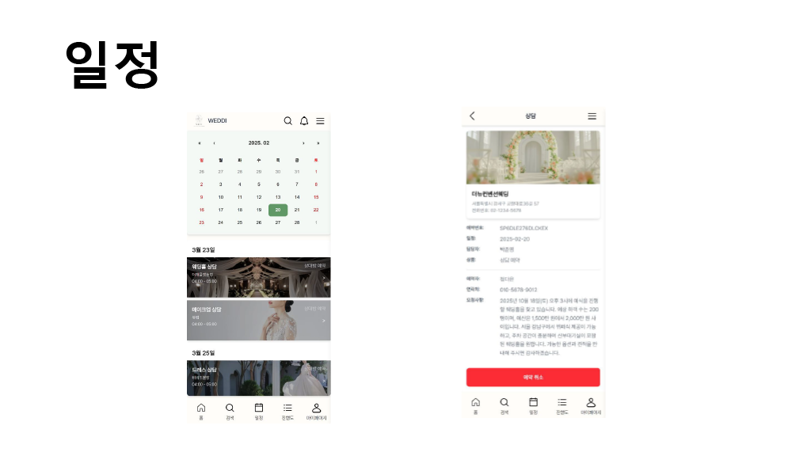
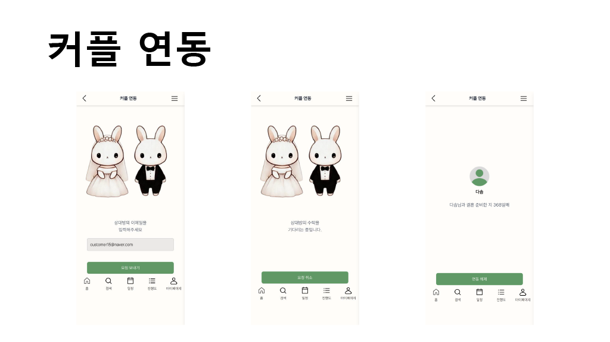
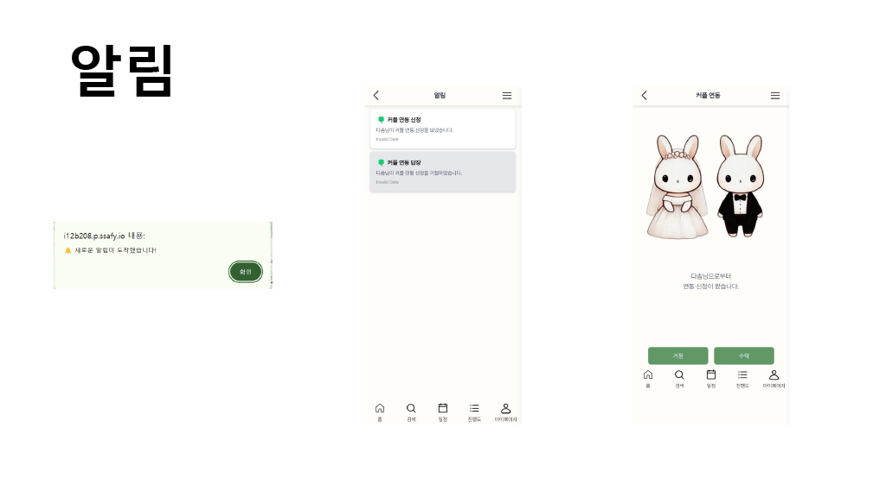
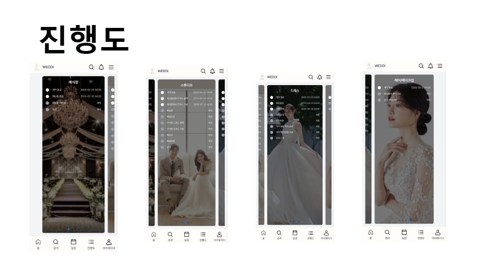
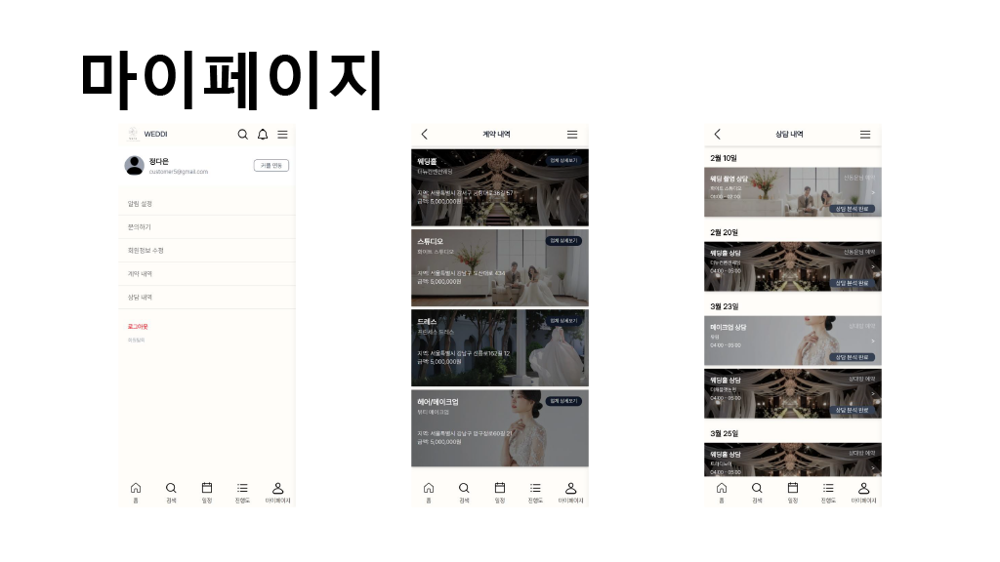
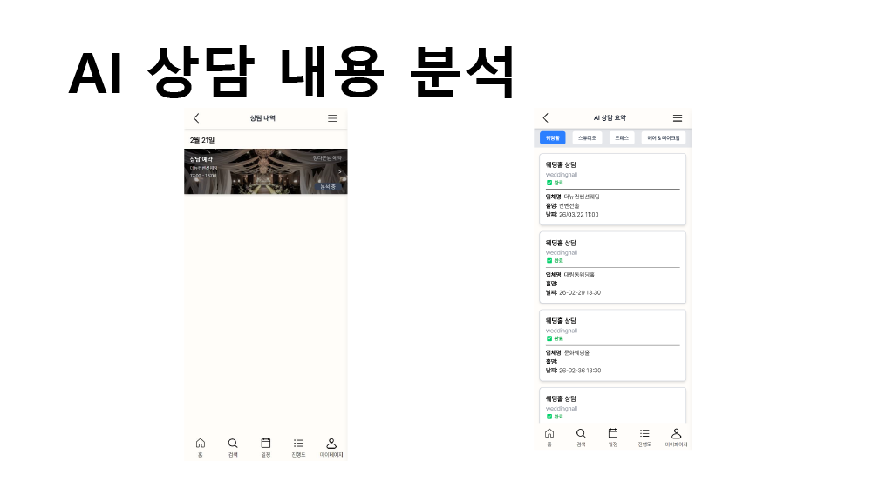


&nbsp;

# 4. 개발 환경  


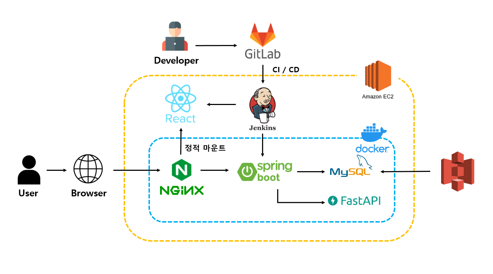


&nbsp;

# 5. 기술 특이점

&nbsp;

## ⭐ 프로젝트의 특장점 (기능 관점)
1. **자동 일정 관리 및 공유 기능**  
   - 고객이 일정을 쉽게 확인할 수 있어 소통 효율성이 높아지고, 불필요한 일정 조율 과정 감소.  

2. **진행 상황 자동 업데이트 기능**  
   - 고객과 업체 간 실시간 상태 공유로 커뮤니케이션 부담 경감 및 업무 효율성 향상.  

3. **AI 기반 추천 기능**  
   - 예산, 스타일, 후기 등을 기반으로 웨딩 업체를 자동 추천하여 고객의 선택 과정 간소화.  

4. **AI 기반 상담 내용 분석 기능**  
   - 상담 내용을 텍스트로 변환 및 요약하여 사용자 경험 개선.  

&nbsp;

## 💡 프로젝트의 차별점 / 독창성 (기술 관점)
1. **파노라마 사진 기반의 360도 뷰 구현**  
   - Pannellum을 활용하여 몰입감 있는 인터랙티브 경험 제공.  

2. **부부 계정 연동 기능**  
   - 세션 기반 인증 시스템을 통해 두 개의 계정을 연동, 실시간 일정 공유 및 데이터 접근 권한 관리.  

3. **AI 플래너**  
   - GPT 기반의 일정 추천 기능을 통해 맞춤형 체크리스트 제공.  

4. **Firebase 기반 알람 기능**  
   - 웨딩 준비 일정 및 주요 알림을 실시간으로 푸시.  

&nbsp;

## 📡 외부 서비스  
### **카카오 API**  
- 닉네임, 프로필 사진, 이메일 연동  
- 카카오 친구 목록 연동  

### **Firebase**  
- Firebase Authentication (이메일/소셜 로그인)  
- Firestore (실시간 데이터 저장)  
- Firebase Storage (미디어 파일 저장)  

### **AI API (OpenAI, Hugging Face)**  
- GPT-4: 웨딩 상담 내용 분석 및 요약  
- OpenAI Whisper: 음성 인식 및 STT  
- Pyannote: 화자 분리 및 음성 분석  
- SBERT: 문장 임베딩 및 웨딩 업체 추천  

### **AWS S3**  
- 파일 저장 및 관리  

&nbsp;

# 6. 기획 및 설계 산출물  

### 요구사항 명세서 
https://held-nephew-fd8.notion.site/v3-11e3e17bbf4c4208ba0c38edb60f20e1

### 와이어 프레임 
https://www.figma.com/design/3T4vbzxt7uhR6XeqVMAXWP/Wevi-%EC%99%80%EC%9D%B4%EC%96%B4%ED%94%84%EB%A0%88%EC%9E%84?node-id=0-1&p=f&t=zdDRgTye2oMXsTSz-0

### ERD 
https://www.notion.so/ERD-89631b828bbd4c3a9ea1666a215b952c

### API 
https://www.notion.so/API-e5e9eb4063154f858accd1f03a012507

&nbsp;

# 7. Conventions  

### Commit Message Structure
- 기본적인 commit message 구조  
   ```
   type: subject
   ```
   - **type**: 어떤 의도로 커밋을 했는지 명시합니다. (ex. feat, refactor)
   - **Subject**: 코드 변경사항을 요약해서 작성합니다. 영문으로 표기하고 마침표는 찍지 않습니다.

### Commit Type  

| Tag Name | Description |
|----------|------------|
| feat | 새로운 기능 추가 |
| fix | 버그 수정 |
| docs | 문서 수정 |
| style | 코드 포맷팅, 코드 변경 없음 |
| refactor | 코드 리팩토링 |
| test | 테스트 코드 추가 |
| chore | 빌드 업무 수정, 패키지 매니저 수정 |
| remove | 파일 삭제 |
| rename | 파일 또는 디렉터리 이동/수정 |

&nbsp;

# 8. 개발 회고  

##### **황성일**<br>
- 적어주세요.

##### **고대권**<br>
- **소감**
   - 이번에 react를 사용해 처음으로 프로젝트를 진행하여 재미있었습니다. 이전 vue로 진행했던 프로젝트에서는 컴포넌트와 페이지뷰를 기능별로만 나누었었습니다. 이번엔 버튼, 입력폼, 카드 등을 공통 컴포넌트로 관리하고, 리스트뷰도 따로 폼을 만들고 관리하여 이후 UI수정이나 유지보수를 좀 더 쉽게 할 수 있었습니다.<br/>다만 이렇게 컴포넌트 분리를 하였음에도, 시간이 촉박하다보니 컴포넌트간 분리가 잘 안되어 리렌더링을 만족할만큼 잡지 못해 아쉬웠습니다.

   - 파이어베이스를 사용해 유저 디바이스기반 실시간 알림서비스를 구현하긴했지만 디바이스 기반 편의성을 제공하기 위해 보안적인 면에서 문제가 발생할 수 있다는 생각이 들었습니다.<br/>편의성 제공과 보안 두 마리 토끼를 잡기 위해선 많은 고민이 필요하다는 것을 느낄 수 있는 프로젝트였습니다.

##### **정윤선**<br>
- **소감 및 만족한 점**: 간단한 프로젝트들을 제외하면 처음으로 Spring을 사용한 팀 프로젝트였는데 무사히 마치게 되어서 기쁩니다. 
백엔드 리더를 맡아 다른 팀원들과 소통하며 개발 실력과 협업 능력을 기를 수 있어 값진 경험이었습니다.
또한 Spring Data JPA, Spring Security를 익혀서 원활하게 사용할 수 있었다는 점에서도 만족스럽습니다.
- **어려웠거나 아쉬웠던 점**: 각 업체의 영업시간을 요일마다 받아서 각 요일에 대해 예약 가능한 시간을 동적으로 생성하도록 설계하고 싶었는데
초반 ERD 설계 시 이 부분을 고려하지 못해서 후반에 수정하기에 어려움이 있었습니다.
또한 외래 키 관계가 복잡해지니 데이터 삭제 시에 관련 오류가 많이 발생해서 다음 개발 때는 이 부분을 고려해서 처음부터 제대로 개발해보려 합니다.
- **다음 개발 때 시도해 볼 점**: 다음에 이번처럼 자동으로 예약 시간을 생성하고 관리해야 할 일이 있다면 이번에 시간 문제로 사용하지 못한 Spring Batch를 사용해보고 싶습니다.
또한 이번 개발 때는 최적화를 고려하지 않았는데, 다음 개발 때는 쿼리 최적화 등을 시도해 보고 싶고, API 응답 속도도 높여보는 경험을 해보고 싶습니다.

##### **박성근**<br>
- 적어주세요.

##### **신동운**<br>
- 적어주세요.
